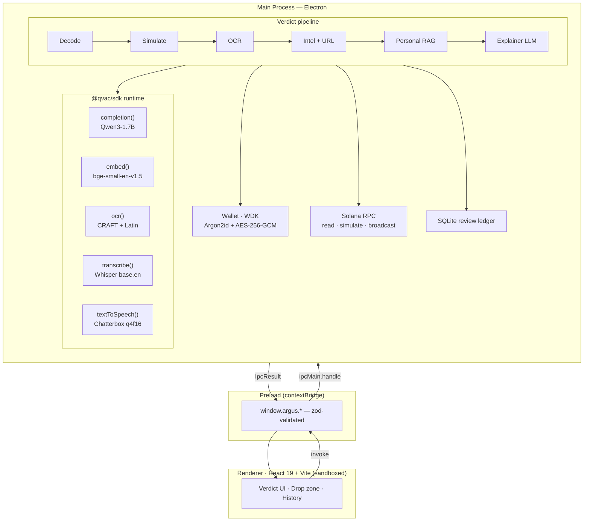
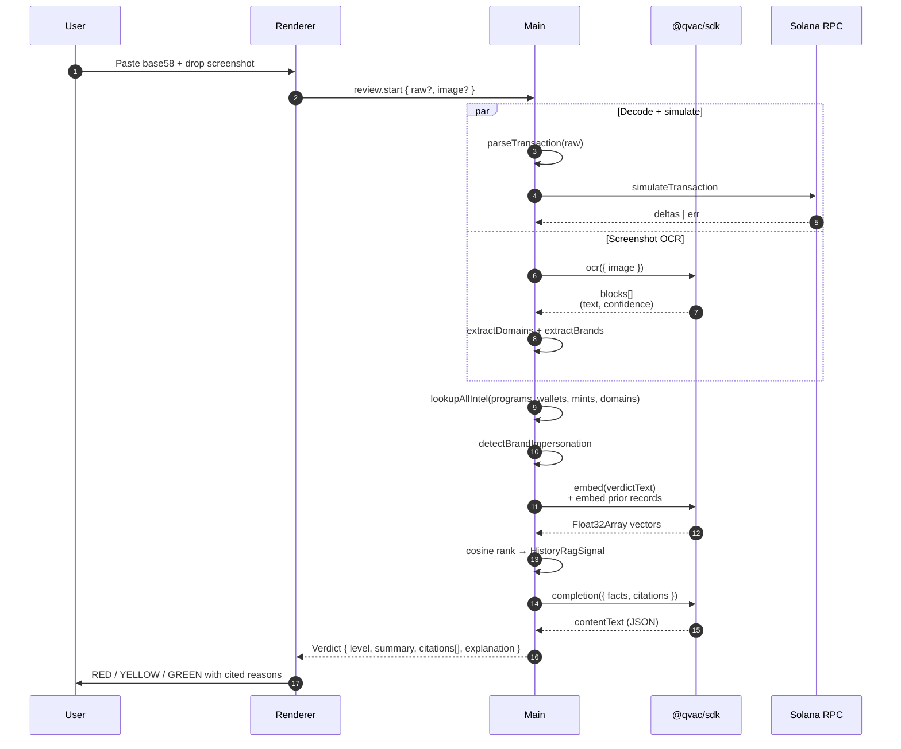

<div align="center">

# Argus

**Local AI in front of every Solana signature.**

A desktop self-custodial wallet with an on-device co-pilot that explains, cross-references, and verdicts every transaction before you sign it. Nothing about your wallet activity ever leaves your machine.

[](https://www.npmjs.com/package/@qvac/sdk)
[](https://wdk.tether.io)
[](#license)
[](https://solana.com)

</div>

---

## Why

Wallet drainers stole an estimated **$2.1B** from retail crypto users in 2024. Three classes of defense exist today, and all of them have a hole:

| Defense | The hole |
|---|---|
| Major wallets (Phantom, Solflare, Backpack) | Raw program IDs and account writes — unintelligible to non-developers, exact-match blocklists only. |
| Browser scam-detection extensions (Wallet Guard, Webacy) | Send every transaction + URL + wallet address to a centralized API. The same leak you came to crypto to avoid. |
| Cloud-LLM transaction explainers | OpenAI-grade reasoning, OpenAI-grade leak. Every signature you'd want explained becomes training data. |

There is a gap for a tool that gives users a *sophisticated AI second opinion* on every signature **without leaking that signature to anyone**. Local AI is the only architecture that resolves this gap. That tool is Argus.

## What it does

Drop a base58 transaction (or a screenshot of the dApp asking you to sign one) into Argus. In under a few seconds you get a verdict — **RED**, **YELLOW**, or **GREEN** — backed by citations only your machine can verify:

- **Decoded.** Every instruction parsed (System / SPL Token / Token-2022 / ATA, plus an "unknown program" path that forces YELLOW).
- **Simulated.** Solana RPC `simulateTransaction`; a rejected simulation forces RED.
- **Cross-referenced.** Local scam-intel store seeded from Mandiant CLINKSINK + SolanaFM (65 real entries: programs, wallets, mints).
- **OCR'd.** Screenshots are read on-device by `@qvac/sdk`'s OCR pipeline; URLs and brand mentions feed two independent signals.
- **Fuzzy-matched.** OCR'd domains are checked against an allow-list of canonical Solana dApps with one-edit Levenshtein, so `magicedem.io` is flagged even if it isn't yet in any blocklist.
- **Brand-impersonation flagged.** A screenshot mentioning "Phantom" without surfacing `phantom.app` (only some look-alike) earns its own RED-eligible citation.
- **History-aware.** A bge-small embedding RAG over your own prior signed/blocked reviews flags transactions that don't look like anything your wallet has done before.
- **Explained in plain English.** A local Qwen3-1.7B (via `@qvac/sdk`) rewrites the deterministic facts. The model never adds facts; on any schema miss, the deterministic explanation shows instead.

Every verdict carries `citations.length >= 1` — schema-enforced at the IPC boundary. If the model can't cite, the renderer doesn't display.

## Architecture

Three processes, one typed contract.



The seed phrase is generated, encrypted, and used for signing **inside the main process only**. It never crosses IPC. No log line includes it. No path to the renderer exists.

## Verdict flow



## Built with QVAC

Every model invocation goes through the **official [@qvac/sdk](https://www.npmjs.com/package/@qvac/sdk)** — Tether's vertically-integrated, on-device AI stack. The same llama.cpp / ONNX runtimes that power QVAC underneath, but called through the canonical SDK surface, with a single lifecycle (`startQVACProvider` / `stopQVACProvider`) registered to Electron's `before-quit`.

| QVAC capability | What it powers in Argus | Status | Source |
|---|---|---|---|
| `@qvac/sdk` · `completion` | Verdict-explainer LLM (Qwen3-1.7B) | **live** | [src/main/verdict/explainer.ts](app/src/main/verdict/explainer.ts) |
| `@qvac/sdk` · `embed` | Personal-history RAG over your prior signed/blocked reviews (bge-small, 384-d cosine) | **live** | [src/main/llm/embedder.ts](app/src/main/llm/embedder.ts) |
| `@qvac/sdk` · `ocr` | EasyOCR pipeline (CRAFT detector + Latin recognizer) over screenshot bytes | **live** | [src/main/ocr/extractor.ts](app/src/main/ocr/extractor.ts) |
| `@qvac/sdk` · `transcribe` | Voice command — say "approve" or "block" on the queued review (Whisper base.en) | **live** | [src/main/ipc/handlers/voice.ts](app/src/main/ipc/handlers/voice.ts) |
| `@qvac/sdk` · `textToSpeech` | Verdict readback through the renderer's AudioContext (Chatterbox q4f16) | **live** | [src/renderer/components/verdict/read-aloud.tsx](app/src/renderer/components/verdict/read-aloud.tsx) |
| `@qvac/sdk` · `translate` | Multi-language verdict explanations | queued | reserved |

The adapter layer is one file, [src/main/llm/qvac.ts](app/src/main/llm/qvac.ts):

```ts
// Boot once per process, lazy.
const sdk = await import("@qvac/sdk");
await sdk.startQVACProvider();

// Load a GGUF or ONNX by absolute path or registered descriptor.
const modelId = await sdk.loadModel({ modelSrc, modelType });

// Five call sites in the verdict + voice paths.
const out           = await sdk.completion({ modelId, history, ... });
const { embedding } = await sdk.embed({ modelId, text });
const { blocks }    = sdk.ocr({ modelId, image });
const text          = await sdk.transcribe({ modelId, audioChunk });
const { buffer }    = sdk.textToSpeech({ modelId, text, stream: false });
```

If the SDK can't initialise — bare-globals polyfill incompatibility, missing model — every helper returns `null` and the verdict pipeline degrades to its deterministic explanation. **The pipeline never hard-fails on a model error.**

## Repository layout

```
.
├── app/                ← Electron desktop app (the product)
│   ├── src/
│   │   ├── main/       ← wallet, Solana, scam-intel, QVAC adapter, verdict pipeline
│   │   ├── preload/    ← typed contextBridge surface
│   │   ├── renderer/   ← React 19 UI
│   │   └── shared/     ← zod IPC contract, shared types
│   ├── docs/           ← AGENTS.md, ARCHITECTURE, SECURITY, ADRs
│   ├── resources/      ← model manifest (SHA-verified)
│   └── scripts/        ← demo:phishing / demo:safe / demo:approve
├── landing_page/       ← Next.js 16 marketing site
└── prd.md              ← canonical hackathon-scoped V1 PRD
```

## Quick start

```bash
git clone https://github.com/yourname/Argus.git
cd Argus/app
npm install              # pulls @qvac/sdk + WDK + better-sqlite3 (rebuilt for Electron)
npm run dev              # starts Electron with HMR
```

First launch downloads the model bundle (Qwen3-1.7B + bge-small + Whisper + Piper, ~1.4 GB total, SHA-verified, resumable). The OCR detector + recognizer are pulled by the QVAC SDK on first screenshot review (~100 MB combined). Once the explainer model is `ready`, the verdict pipeline switches from deterministic-only to QVAC-backed automatically.

### Demo scenarios

Three scripted base58 transactions exercise the full pipeline end-to-end — no mocks, real decode, real simulation, real intel lookup:

```bash
npm run demo:phishing    # spl-approve to a known-bad delegate → RED with citations
npm run demo:safe        # SOL transfer to a familiar address → GREEN-leaning YELLOW
npm run demo:approve     # approves a queued review and broadcasts to devnet
```

### Useful scripts

```bash
npm run typecheck        # tsc --noEmit
npm run lint             # ESLint flat config
npm run test             # vitest (decoder, url-intel, history-rag)
npm run build            # electron-vite + electron-builder (DMG / EXE)
```

## What's shipping

- ☑ Wallet primitives via WDK — mnemonic gen + import, Solana derivation, Argon2id-encrypted keystore
- ☑ Transaction decode + simulate (System / SPL / Token-2022 / ATA, unknown-program YELLOW)
- ☑ Sign + broadcast — Solscan link surfaced on confirm
- ☑ Local scam-intel — 65 real entries from Mandiant CLINKSINK + SolanaFM
- ☑ Screenshot OCR via `@qvac/sdk` — CRAFT + Latin recognizer
- ☑ URL allow-list with Levenshtein-1 fuzzy match (typo-squat detection)
- ☑ Brand-impersonation citation (OCR-derived, independent of blocklist hits)
- ☑ Personal-history RAG via `@qvac/sdk` `embed` (bge-small, with deterministic lexical fallback)
- ☑ Local explainer LLM via `@qvac/sdk` `completion` (Qwen3-1.7B, JSON-schema-validated, deterministic fallback)
- ☑ Voice command — `@qvac/sdk` `transcribe` (Whisper base.en) parses "approve" / "block" on the queued review
- ☑ Verdict readback — `@qvac/sdk` `textToSpeech` (Chatterbox q4f16) via renderer AudioContext
- ☑ Three end-to-end demo scripts

## What's queued

- ☐ `@qvac/sdk` `translate` — multilingual verdict explanations
- ☐ Multimodal vision over screenshots — pending QVAC SDK projection-model loading on this version
- ☐ Phantom-blocklist full ~2,300-entry scrape

## Security posture

- **Seed isolation.** The mnemonic never crosses an IPC channel. `window.argus.*` exposes signing-by-id; the seed lives in main's keystore only.
- **Zero outbound at runtime.** Allow-list-checked: Solana RPC, the model CDN (first launch only), and nothing else. No telemetry, no analytics, no error reporting, no auto-update phone-home.
- **SHA-verified models.** Every GGUF / ONNX file is SHA-256 verified against the bundled manifest before the registry marks it ready.
- **Mandatory citations.** A verdict the renderer cannot trace back to at least one local signal will not display. Schema-enforced.
- **Honest uncertainty.** "Unknown program" forces YELLOW — never silent green. See [docs/DESIGN-PRINCIPLES.md](app/docs/DESIGN-PRINCIPLES.md) §3.
- **Renderer sandbox.** `nodeIntegration: false`, `contextIsolation: true`, `sandbox: true`. The renderer has no filesystem, no network, no node.

Detailed model in [docs/SECURITY.md](app/docs/SECURITY.md). Architectural decisions documented as ADRs in [app/docs/decisions/](app/docs/decisions/).

## Hackathon

Submitted to:

- **Tether Frontier Side Track** ($10K USDt) — meaningful `@qvac/sdk` integration: **5 of 6 SDK capabilities live** (`completion`, `embed`, `ocr`, `transcribe`, `textToSpeech`); `translate` queued.
- **Solana Frontier Hackathon** main pool.

Deadline: **May 11, 2026, 23:59 UTC**.

## License

MIT — see [LICENSE](LICENSE).

---

<div align="center">
<sub>Built with <a href="https://www.npmjs.com/package/@qvac/sdk">@qvac/sdk</a> · <a href="https://wdk.tether.io">WDK</a> · <a href="https://solana.com">Solana</a> · <a href="https://www.electronjs.org">Electron</a></sub>
</div>
