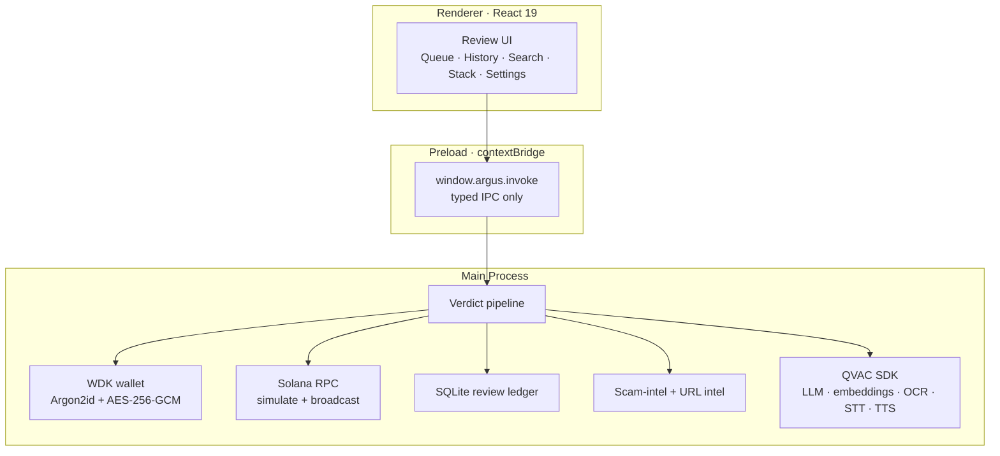
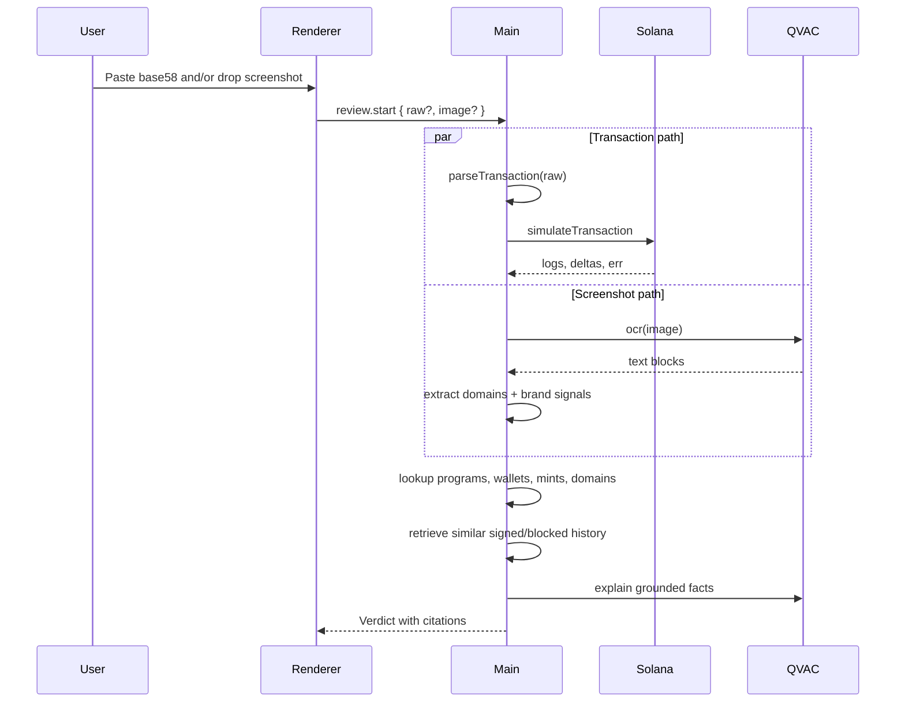

<div align="center">

# Argus

**A private AI security layer for every Solana signature.**

Argus is a self-custodial desktop wallet that reviews transactions before the user signs. It decodes the on-chain action, simulates the transaction, checks local threat intelligence, reads suspicious screenshots, compares against the user's own history, and returns a cited verdict without sending wallet activity to a third-party inference API.

[](https://www.npmjs.com/package/@qvac/sdk)
[](https://wdk.tether.io)
[](https://solana.com)
[](#license)

</div>

---

## The Problem

Wallet drainers are not winning because users are careless. They are winning because most signing prompts still ask people to approve opaque program IDs, token approvals, delegate writes, and marketplace calls with too little context.

Existing defenses force a bad tradeoff:

| Approach | What breaks |
|---|---|
| Wallet-native warnings | Fast, but mostly exact-match blocklists and raw technical labels. |
| Browser security extensions | Useful, but transaction data, URLs, and wallet addresses often leave the device. |
| Cloud AI explainers | Better language, worse privacy. The most sensitive signature data goes to someone else's server. |

Argus is built around a different premise: the security review should be intelligent, cited, and local.

## What Argus Does

The user can paste a base58 Solana transaction, drop a screenshot of the dApp or message asking them to sign, or provide both. Argus returns a verdict with evidence:

- **Decode:** Parses System, SPL Token, Token-2022, ATA, Jupiter, Magic Eden, and unknown-program instructions.
- **Simulate:** Runs Solana `simulateTransaction`; rejected simulations become RED.
- **Check local intelligence:** Looks up programs, wallets, mints, and domains against bundled scam-intel.
- **Read screenshots:** OCR extracts visible domains and brand mentions from dApp, Telegram, Discord, or browser screenshots.
- **Catch lookalikes:** URL intel includes Phantom-blocked domains plus Levenshtein-1 matching against canonical Solana dApps.
- **Compare personal history:** Prior signed and blocked reviews become a local retrieval layer, so unusual transactions stand out.
- **Explain clearly:** QVAC-backed local models turn deterministic facts into plain English, with deterministic fallback if a model is unavailable.

Every verdict must include at least one citation. If Argus cannot ground the verdict in a local signal, the renderer will not display it as if it were certain.

## Product Flow

1. User pastes a transaction or drops a screenshot.
2. Argus runs decode, simulation, OCR, scam-intel, URL intel, and personal-history retrieval.
3. The verdict card shows RED / YELLOW / GREEN, a concise explanation, and citations.
4. If a transaction is present, the user can approve or block.
5. Approved transactions are signed locally and broadcast. Blocked and signed reviews remain searchable in the local ledger.

Image-only reviews never show signing controls. They are treated as intelligence reviews, not transactions.

## Technical Architecture

Argus is an Electron desktop app with a strict process boundary:



The seed phrase never crosses IPC. The renderer has no filesystem access, no Node integration, and no direct signing primitive. It can ask main to approve a pending review by ID; main decides whether that review is still pending and signable.

## Verdict Pipeline



The model is not allowed to invent facts. The deterministic pipeline owns the level, citations, decoded instructions, and simulation result. The explainer rewrites those facts into a clearer explanation and falls back to deterministic copy on schema miss, runtime miss, or model error.

## Built With QVAC

Argus uses the official `@qvac/sdk` as the on-device AI runtime. That matters because the product promise depends on local inference: the same context that makes a transaction worth explaining is exactly the context that should not be sent to a remote AI endpoint.

| Capability | Product use |
|---|---|
| `completion` | Qwen3-1.7B verdict explanation from grounded facts |
| `embed` | Personal-history retrieval over signed and blocked reviews |
| `ocr` | Screenshot text extraction for URLs and brand impersonation |
| `transcribe` | Voice command path for approve / block |
| `textToSpeech` | Verdict readback |

Model files are downloaded into the app data directory, verified against the bundled manifest, and loaded only after integrity checks pass.

## Local Intelligence

Argus ships with local threat data instead of depending on a remote scoring API:

- Mandiant CLINKSINK drainer wallets.
- SolanaFM flagged scam-token wallets and mints.
- Canonical Solana dApp domains.
- Phantom-blocked phishing and typo-squat domains.
- One-edit fuzzy matching for unknown domains close to trusted Solana brands.
- Brand-impersonation policy for screenshots that mention a brand without showing its canonical domain.

The URL corpus can be refreshed with:

```bash
cd app
npm run refresh:intel
```

## Repository Layout

```text
.
├── app/                Electron desktop product
│   ├── src/main/       wallet, Solana, OCR, QVAC, intel, verdict pipeline
│   ├── src/preload/    typed contextBridge IPC surface
│   ├── src/renderer/   React UI
│   ├── src/shared/     zod IPC contract and shared types
│   ├── resources/      model manifest and bundled data
│   └── scripts/        demo and intel refresh scripts
├── landing_page/       marketing site
└── Product spec        requirements and hackathon scope
```

## Quick Start

```bash
git clone https://github.com/yourname/Argus.git
cd Argus/app
npm install
npm run dev
```

First launch downloads and verifies the local model bundle. Downloads are resumable, and model readiness is visible in the Stack / setup screens.

## Demo Scenarios

```bash
cd app
npm run demo:phishing
npm run demo:safe
npm run demo:approve
```

The demos exercise the actual decode, simulation, intel, history, and verdict path. They are intended for judge walkthroughs and local smoke tests, not mocked screenshots.

## Useful Commands

```bash
cd app
npm run typecheck
npm run lint
npm run test
npm run build
```

## Current Scope

Implemented:

- Wallet create / import / unlock / lock.
- Model downloader with resumable downloads and SHA verification.
- Transaction decode, simulation, sign, and broadcast.
- SQLite review ledger with Queue, History, and Search.
- Local scam-intel and URL intel.
- Screenshot OCR and drag / paste review flow.
- Personal-history retrieval.
- Local QVAC explainer with deterministic fallback.
- Voice command and readback paths.

Product direction:

- Broader language support for verdict explanations.
- Automatic refresh for bundled threat intelligence.
- Deeper screenshot reasoning for brand and interface impersonation.

## Security Posture

- **Self-custody:** wallet keys live only in main process.
- **Typed IPC:** every channel is declared in one zod registry.
- **Renderer sandbox:** no Node integration, no filesystem, no direct signing.
- **Local-first AI:** verdict context stays on device.
- **Cited decisions:** verdicts are grounded in decode, simulation, OCR, intel, or history.
- **Honest uncertainty:** unknown programs and unfamiliar behavior do not silently become GREEN.

## License

MIT.
