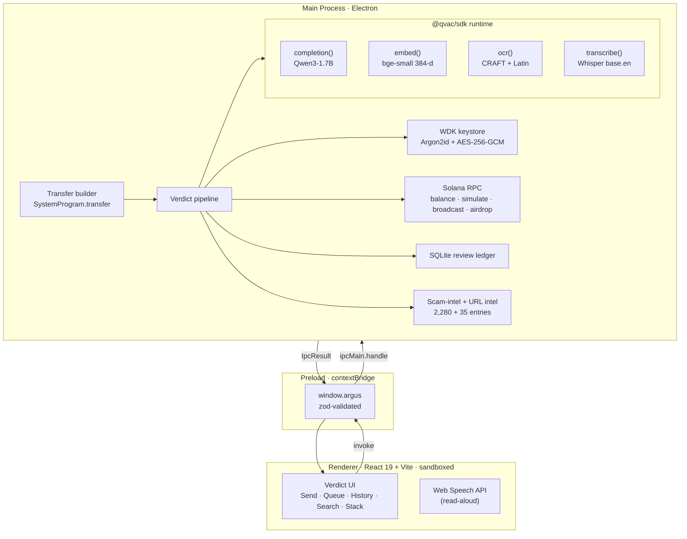
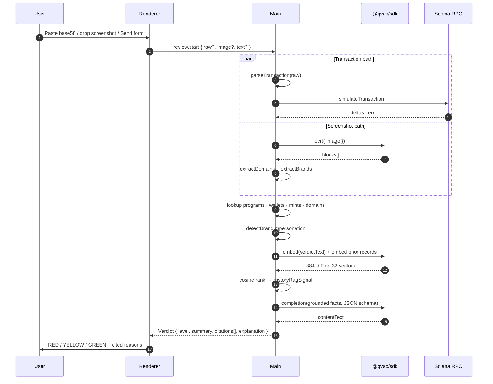
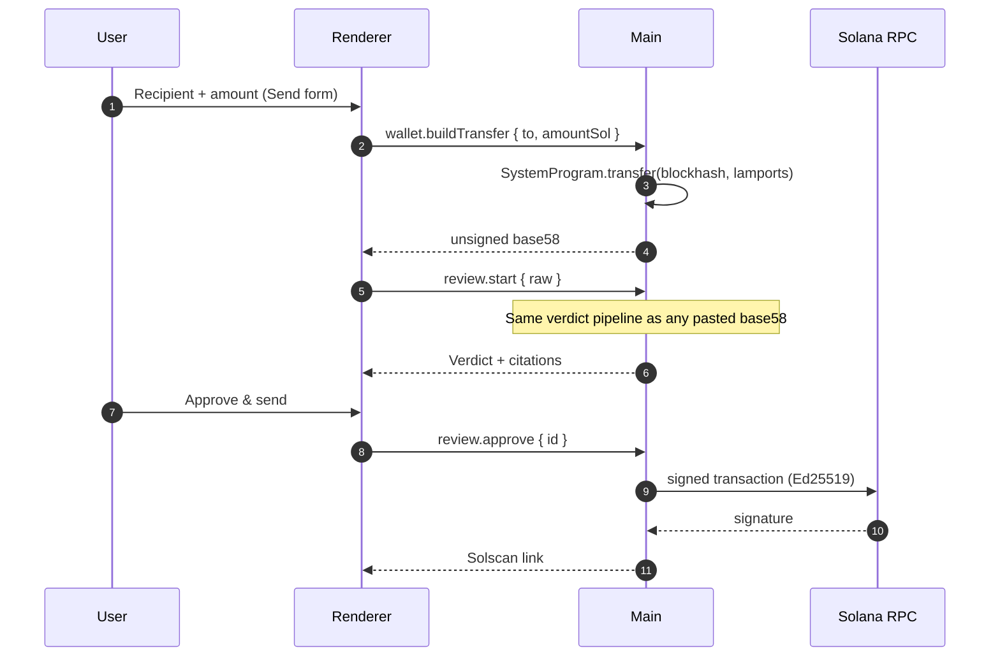

<div align="center">

# Argus

**A private, on-device AI security layer for every Solana signature.**

Argus is a self-custodial desktop wallet whose every transaction — including the user's own outgoing transfers — is routed through a local AI verdict pipeline before it can be signed. No transaction context, screenshot, or wallet activity ever leaves the device.

[](https://www.npmjs.com/package/@qvac/sdk)
[](https://wdk.tether.io)
[](https://solana.com)
[](#license)

</div>

---

## At a glance

| | |
|---|---|
| **`@qvac/sdk` capabilities on the call path** | **4 live** (`completion`, `embed`, `ocr`, `transcribe`) + 1 wired-but-deferred (`textToSpeech`) |
| **Local URL intelligence** | **2,280 entries** (2,247 from the live `github.com/phantom/blocklist` scrape + 34 hand-curated typo-squats, commit-pinned for reproducibility) |
| **Local on-chain intelligence** | **35 entries** (19 wallets / 6 programs / 10 mints from Mandiant CLINKSINK + SolanaFM) |
| **Network at runtime** | Solana RPC + a one-time model CDN fetch. No telemetry, no analytics, no error reporting, no cloud inference. |
| **Wallet stack** | WDK (Tether) — Argon2id keystore, AES-256-GCM at rest, ed25519 signing, seed never crosses IPC |
| **Cluster default** | Devnet — judges can airdrop test SOL in one click, broadcasts produce real Solscan-resolvable links |
| **License** | MIT |

---

## The problem

Wallet drainers stole an estimated $2.1B from retail crypto users in 2024. The three existing defenses each have a hole big enough for a drainer to walk through:

| Defense | The hole |
|---|---|
| Wallet-native warnings (Phantom, Solflare, Backpack) | Raw program IDs and account writes. Exact-match blocklists. Unintelligible to a non-developer. |
| Browser security extensions (Wallet Guard, Webacy, Pocket Universe) | Send every transaction's metadata, the visited URL, and often the wallet address to a centralized API. The same leak you came to crypto to avoid. |
| Cloud-LLM transaction explainers | OpenAI-grade reasoning, OpenAI-grade leak. Every signature you'd want explained becomes training data. |

There is a gap for a sophisticated AI second opinion on every signature **without leaking that signature to anyone**. That's the gap Argus fills, and on-device inference is the only architecture that resolves it.

## What Argus does

Three ways to start a review:

- **Paste a base58 transaction.** Developers and paranoid signers.
- **Drop a screenshot.** The everyday user. Phishing pages, Telegram bait, Discord scams — any image gets read, URLs extracted, brand impersonation cross-referenced.
- **Build a transfer in-app.** The wallet's own Send flow. The unsigned base58 the wallet produces is routed back through the same verdict pipeline as a pasted transaction before the signing path runs. "In front of every signature" stops being a slogan and becomes a literal constraint of the data flow.

Argus returns a verdict — **RED / YELLOW / GREEN** — and every level carries at least one citation that the local machine can verify:

- **Decode.** Parses System, SPL Token, Token-2022, ATA, Jupiter, Magic Eden, and explicitly forces YELLOW on unknown programs (never silently green).
- **Simulate.** Solana RPC `simulateTransaction`. Rejected sim ⇒ RED.
- **Local scam-intel.** 35 wallet / program / mint entries from Mandiant CLINKSINK + SolanaFM, looked up against decoded instructions.
- **URL intel.** 2,247 Phantom-flagged phishing domains, plus 34 hand-curated typo-squats with explicit `mimics` labels, plus one-edit Levenshtein fuzzy matching against canonical Solana dApps.
- **Brand impersonation.** OCR cross-references brand mentions (Phantom, Magic Eden, Jupiter, …) against extracted URLs. A screenshot that says *"Connect Phantom"* but the URL is `phantomweb.app` earns a dedicated citation.
- **Personal-history RAG.** Prior signed and blocked reviews are embedded with `bge-small-en-v1.5` (384-d) via `@qvac/sdk` `embed`; cosine similarity flags transactions outside the user's normal pattern.
- **Local explainer.** `Qwen3-1.7B` via `@qvac/sdk` `completion` turns the deterministic facts into plain English. The model is not allowed to invent facts; on any schema miss it falls back to a deterministic explanation. The verdict card shows `QVAC` or `Local` so the user knows which produced the text.

Every verdict is grounded. The renderer refuses to display a verdict without citations.

## Why this wins on the Tether Frontier rubric

The track scores on four criteria. Here is how Argus addresses each:

1. **Technical depth of QVAC integration · 40 %.**
   - 4 SDK capabilities are *actively on the call path* of every demo review: `completion` (explainer), `embed` (personal-history RAG), `ocr` (screenshot text), `transcribe` (voice command).
   - 1 more capability (`textToSpeech`) is wired in main (`voice.speak` IPC + `synthesizeSpeech()` against the Chatterbox descriptor), with the default user button using Web Speech for instant playback rather than the multi-GB cold-start.
   - The QVAC SDK lifecycle is owned end-to-end: `startQVACProvider()` on first call, `loadModel({ modelSrc, modelType })` for each capability, `stopQVACProvider()` registered to Electron's `before-quit` with a 3-second timeout and automatic stale-lock cleanup at next boot.
   - All failure modes degrade gracefully — every QVAC helper returns `null` on error, never throws to its caller. Verdicts always emit.
2. **Product value · 30 %.**
   - $2.1B/year problem. Real intel sources (Mandiant CLINKSINK, SolanaFM, Phantom's own blocklist). Real WDK keystore. Real Solana RPC. Real broadcast.
   - The Send flow is the proof: the wallet cannot sign without first passing its own transaction through the AI gate. No other Solana wallet ships this exact data-flow constraint today.
3. **Innovation · 20 %.**
   - **Verdict-first design with mandatory citations.** Most "AI wallet" pitches are GPT wrappers; Argus inverts it — the model rewrites grounded facts, the deterministic pipeline owns truth.
   - **Personal-history RAG.** Cloud AI literally cannot do this — your prior signed/blocked reviews aren't training data anywhere else. Cosine ranking against `bge-small` embeddings flags outliers that exact-match blocklists miss.
   - **Brand-impersonation cross-reference.** Novel signal: a screenshot mentioning a brand without surfacing that brand's canonical domain is a RED-eligible citation even when the impostor URL isn't yet in any blocklist.
4. **Demo quality · 10 %.**
   - Three working demo scripts (`demo:phishing`, `demo:safe`, `demo:approve`).
   - Devnet airdrop button so a fresh wallet funds itself in one click.
   - Mermaid architecture + sequence diagrams in this README. Sixteen ADRs in [`app/docs/decisions/`](app/docs/decisions/) documenting every material choice.

---

## Technical architecture

Three processes, one typed contract.



The seed phrase is generated, encrypted, and used for signing **inside the main process only**. It never crosses an IPC channel. No log line includes it. The renderer has no Node integration, no filesystem access, no direct signing primitive.

## Verdict pipeline



The deterministic pipeline owns level, citations, decoded instructions, and simulation result. The QVAC explainer rewrites those facts into a clearer explanation and falls back to deterministic prose on schema miss, runtime miss, or model error. **The model is never authoritative.**

## Built with QVAC

Every model call on the verdict path goes through the official [`@qvac/sdk`](https://www.npmjs.com/package/@qvac/sdk). The same GGUF / ONNX models the SDK ships, the same llama.cpp / ONNX runtimes underneath, but called through the canonical SDK surface with a single lifecycle.

| QVAC capability | What it powers in Argus | Status | Source |
|---|---|---|---|
| `completion` | Verdict-explainer LLM (Qwen3-1.7B) | **live** | [explainer.ts](app/src/main/verdict/explainer.ts) |
| `embed` | Personal-history RAG (bge-small-en-v1.5, 384-d cosine) | **live** | [embedder.ts](app/src/main/llm/embedder.ts) |
| `ocr` | EasyOCR pipeline (CRAFT detector + Latin recognizer) over screenshot bytes | **live** | [extractor.ts](app/src/main/ocr/extractor.ts) |
| `transcribe` | Voice command — "approve" / "block" on the queued review (Whisper base.en) | **live** | [voice.ts](app/src/main/ipc/handlers/voice.ts) |
| `textToSpeech` | Chatterbox synth wired in main; Web Speech in renderer for instant playback | **wired** | [qvac.ts:synthesizeSpeech](app/src/main/llm/qvac.ts) |
| `translate` | Multilingual verdict explanations | queued | — |

The adapter is one file — [src/main/llm/qvac.ts](app/src/main/llm/qvac.ts):

```ts
// Boot once per process, lazy. Auto-cleans stale locks left by crashed sessions.
const sdk = await import("@qvac/sdk");
await sdk.startQVACProvider();

// Load a GGUF or ONNX by absolute path or registered descriptor.
const modelId = await sdk.loadModel({ modelSrc, modelType });

// Active call sites on the verdict + voice paths:
const out           = await sdk.completion({ modelId, history, ... });
const { embedding } = await sdk.embed({ modelId, text });
const { blocks }    = sdk.ocr({ modelId, image });
const text          = await sdk.transcribe({ modelId, audioChunk });
```

If the SDK can't initialise — bare-globals polyfill incompatibility, missing model, fd-lock contention — every helper returns `null` and the verdict pipeline degrades to its deterministic explanation. **The pipeline never hard-fails on a model error.**

## Local intelligence

Argus ships threat data with the app instead of depending on a remote scoring API:

- **Mandiant CLINKSINK** drainer hot-wallets (the largest documented Solana wallet-drainer campaign of 2024).
- **SolanaFM-flagged** scam-token wallets and mints.
- **Phantom's official blocklist** — 2,247 phishing domains, scraped to a pinned upstream commit so reviewers can verify provenance: `urlIntelHealth()` returns the SHA + commit date.
- **Hand-curated typo-squats** with explicit `mimics: magiceden.io` etc. labels so the verdict reads *"typo-squat of Magic Eden"* rather than *"phishing domain"*.
- **One-edit fuzzy matching** for unknown domains close to canonical Solana brands — catches typo-squats that haven't hit the blocklist yet.
- **Brand-impersonation policy** for screenshots that name a brand without surfacing its canonical domain.

The URL corpus can be refreshed against the upstream Phantom repo with:

```bash
cd app
npm run refresh:intel
```

The bundled JSON snapshot at `app/resources/data/phantom-blocklist.json` records the upstream commit SHA + commit date.

## Wallet flow — the Send route

The Send route is the moment Argus stops being a transaction analyzer that ships with a wallet, and becomes a wallet whose every signature physically cannot bypass its own AI co-pilot.



The unsigned transaction sits in the review ledger between Build and Approve. If the user closes the app or hits Block, no signature is ever produced — the keystore was never asked to sign.

## Repository layout

```text
.
├── app/                Electron desktop product
│   ├── src/main/       wallet · Solana · OCR · QVAC adapter · intel · verdict pipeline
│   ├── src/preload/    typed contextBridge IPC surface
│   ├── src/renderer/   React 19 UI
│   ├── src/shared/     zod IPC contract and shared types
│   ├── resources/      model manifest + bundled intel snapshot
│   ├── scripts/        demo + intel-refresh scripts
│   └── docs/           ARCHITECTURE, SECURITY, DESIGN-PRINCIPLES, 16 ADRs
├── landing_page/       Next.js 16 marketing site
└── prd.md              canonical hackathon-scoped V1 PRD
```

## Quick start

```bash
git clone <repo-url>
cd Argus/app
npm install                # pulls @qvac/sdk + WDK + better-sqlite3, rebuilt for Electron
npm run dev                # boots Electron with HMR
```

First launch downloads the local model bundle (~1.4 GB total, SHA-verified, resumable; pause/resume on the Stack route). The OCR detector + recognizer (~90 MB) are pulled lazily by the QVAC SDK on first screenshot review.

## Demo arc

A 2-minute walkthrough that exercises the full stack:

```bash
cd app

# 1. Boot, create wallet, then hit ⌘S (Send route).
npm run dev

# 2. Click the "Get 0.1 test SOL" button. Devnet airdrop confirms in ~10s.
#    Wallet balance refreshes in the sidebar pill.

# 3. Send 0.01 SOL to any valid Solana address.
#    The verdict card appears with `QVAC` on the explanation pill.
#    Click "Approve & send".
#    Solscan link resolves to a confirmed devnet transaction.

# 4. Run the seeded phishing scenario:
npm run demo:phishing
#    Verdict returns RED with the drainer-wallet citation.

# 5. Drag a screenshot of any Solana site or DM into Review.
#    OCR fires; URL + brand-impersonation signals join the verdict.
```

Or use the broadcast helper:

```bash
npm run demo:safe      # safe transfer fixture
npm run demo:approve   # auto-approves a queued review and broadcasts
```

## Useful commands

```bash
cd app
npm run typecheck         # tsc --noEmit
npm run lint              # eslint flat config
npm run test              # vitest (decoder, URL intel, history-rag)
npm run build             # electron-vite + electron-builder
npm run refresh:intel     # re-scrape Phantom blocklist; updates the bundled snapshot
```

## Security posture

- **Self-custody.** The wallet keystore lives only in the main process; the mnemonic never crosses IPC.
- **Typed IPC.** Every channel is declared in [`src/shared/ipc.ts`](app/src/shared/ipc.ts) with zod input + output schemas. The renderer cannot invoke an undeclared channel; main cannot register one.
- **Renderer sandbox.** `nodeIntegration: false`, `contextIsolation: true`, `sandbox: true`. No filesystem, no Node, no network from the renderer.
- **Allow-list at runtime.** Only Solana RPC + the model CDN (on first launch) are reachable. No telemetry, no analytics, no error reporting, no auto-update phone-home.
- **SHA-verified models.** Every GGUF / ONNX file is verified against the bundled manifest before the registry marks it ready.
- **Mandatory citations.** A verdict the renderer cannot trace back to at least one local signal will not display. Schema-enforced.
- **Honest uncertainty.** Unknown programs force YELLOW — never silent green. See [DESIGN-PRINCIPLES.md](app/docs/DESIGN-PRINCIPLES.md) §3.

Full threat model: [SECURITY.md](app/docs/SECURITY.md). Material architectural decisions: 16 ADRs in [docs/decisions/](app/docs/decisions/).

## Hackathon

Submitted to:

- **Tether Frontier Side Track** ($10K USDt) — 4 `@qvac/sdk` capabilities live on the demo path, 1 wired, 1 queued. Meaningful integration as defined by the rubric: not a wrapper, not a demo, structurally on the call path of every verdict.
- **Solana Frontier Hackathon** main pool.

Deadline: **May 11, 2026, 23:59 UTC**.

## License

MIT — see [LICENSE](LICENSE).

---

<div align="center">
<sub>Built with <a href="https://www.npmjs.com/package/@qvac/sdk">@qvac/sdk</a> · <a href="https://wdk.tether.io">WDK</a> · <a href="https://solana.com">Solana</a> · <a href="https://www.electronjs.org">Electron</a></sub>
</div>
